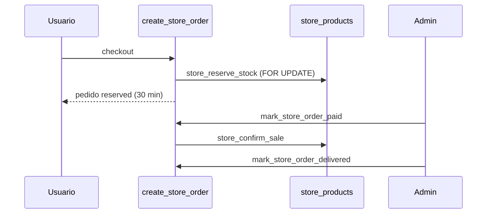

# Arquitectura — Tienda / Merchandising

## Tablas principales

- `store_products` — catálogo global
- `store_product_variants` — variantes con stock independiente
- `store_collections` + `store_collection_products`
- `event_store_settings` — configuración merch por evento
- `event_store_products` — asociación producto ↔ evento
- `store_orders` + `store_order_items`
- `store_stock_movements` — auditoría

## Flujo de stock

## Badge en eventos

Función `event_has_available_store_merch(event_id)` valida:

1. `event_store_settings.merchandising_enabled`
2. Evento publicado
3. Producto activo y en vigencia
4. Stock disponible (producto o variantes)

## Fidelización

- Flag: `community_settings.store_points_enabled`
- RPC: `award_loyalty_points_for_store_order` (solo service_role)
- Idempotency: `store_order:{id}:earn`
- Cancelación: `reverse_loyalty_points_for_store_order`

## Pagos

Sin pasarela automática. Estados:

- `reserved` + `payment_status=pending` al crear
- Admin confirma con `mark_store_order_paid`
- Arquitectura preparada para webhook MP futuro
